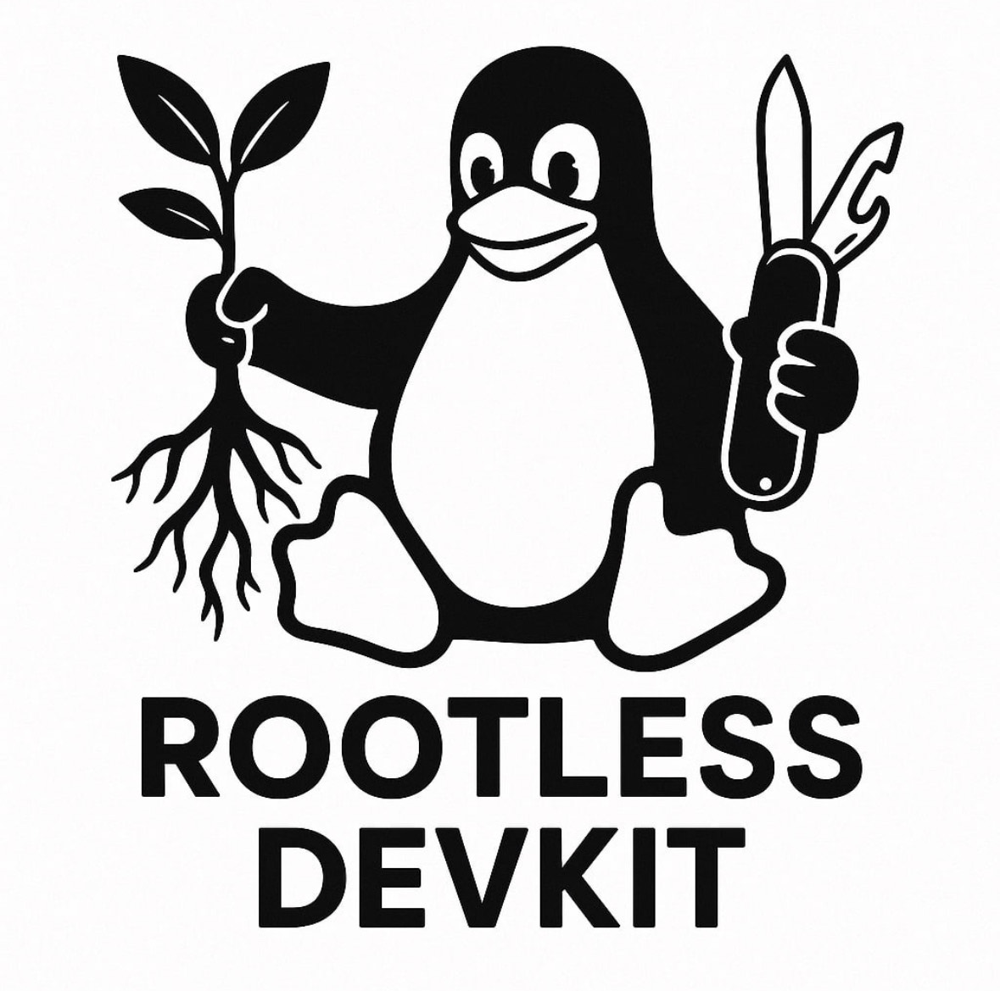

# Linux Rootless DevKit

**Linux Rootless DevKit** is a streamlined and enhanced Linux environment designed specifically for Virtual Desktop Infrastructure (VDI) setups.

It provides users with a modern, efficient, and user-friendly desktop experience by bundling carefully selected tools, shell configurations, and utilities that improve productivity and system usability.

Key features include:

- Pre-configured shell environments with **Oh My Bash** and **Oh My Zsh**
- A curated set of fast and modern CLI tools written in Rust and Go
- Enhanced terminal experience with better history management, fuzzy search, and Git integrations
- Simplified and consistent setup tailored for VDI environments
- Focus on performance, stability, and ease of use

Linux Rootless DevKit helps users get the most out of their Linux desktop on virtual machines, making work smoother and more enjoyable from day one.
