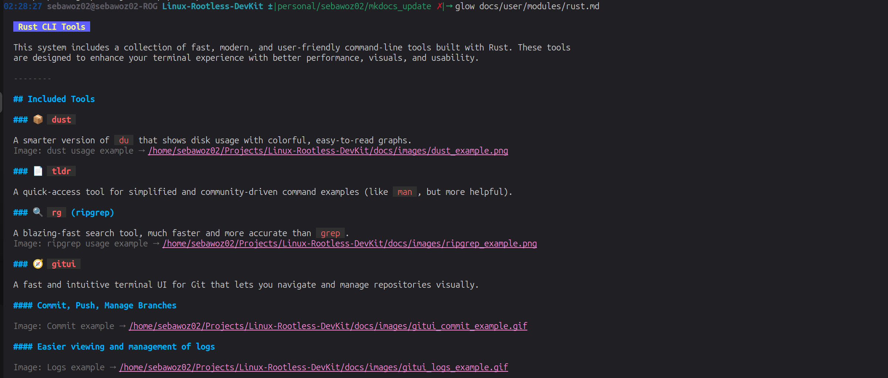
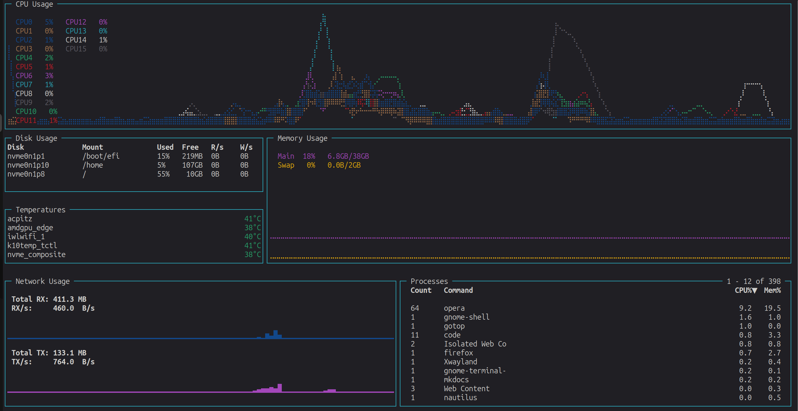

**Go** (also known as **Golang**) is a modern programming language created by Google. It’s known for being **fast, simple, and reliable**, making it perfect for building powerful command-line tools and system utilities.

---

## Included Tools

### 📄 `glow`  
A terminal-based Markdown reader with a clean and visually appealing interface.  
Great for previewing README files, documentation, or any `.md` content right in the terminal.  
Works well with local files and even supports browsing Markdown files from GitHub repositories.

**Source:** <a href="https://github.com/charmbracelet/glow" target="_blank">https://github.com/charmbracelet/glow</a>

---

### 📉 `gotop`  
A fast and modern terminal-based system monitor, inspired by `htop` but with better visuals and customization.  
Provides real-time metrics for CPU, memory, network, and more, in a colorful and interactive dashboard.  
Includes graphs, per-core breakdowns, and system uptime.

**Source:** <a href="https://github.com/xxxserxxx/gotop" target="_blank">https://github.com/xxxserxxx/gotop</a>

---

### 🔥 `hey`  
A tiny and powerful HTTP load testing tool.  
Use it to benchmark REST APIs and web servers by sending multiple concurrent requests and analyzing response times.  
Ideal for developers looking to stress-test their backend under load.

**Source:** <a href="https://github.com/rakyll/hey" target="_blank">https://github.com/rakyll/hey</a>

---

### 🐳 `lazydocker`  
A simple and intuitive TUI for managing Docker containers, images, volumes, and more.  
No more remembering long Docker commands—just run `lazydocker` and interactively navigate through your Docker environment.  
Perfect for developers who want a smoother Docker workflow in the terminal.

**Source:** <a href="https://github.com/jesseduffield/lazydocker" target="_blank">https://github.com/jesseduffield/lazydocker</a>

---

### 🔐 `age`  
A modern, secure, and simple file encryption tool.  
Designed to replace `gpg` with a more user-friendly interface and safer defaults.  
Encrypt and decrypt files easily using passphrases or public keys, ideal for secure file sharing and automation.

**Source:** <a href="https://github.com/FiloSottile/age" target="_blank">https://github.com/FiloSottile/age</a>

---

Go helps make your system tools **faster, cleaner, and more efficient** — all while staying simple to use.

### Useful Links
- Official Website: <a href="https://golang.org/" target="_blank">https://golang.org/</a>
- Documentation: <a href="https://pkg.go.dev/std" target="_blank">https://pkg.go.dev/std</a>
- GitHub Repository: <a href="https://github.com/golang/go" target="_blank">https://github.com/golang/go</a>
