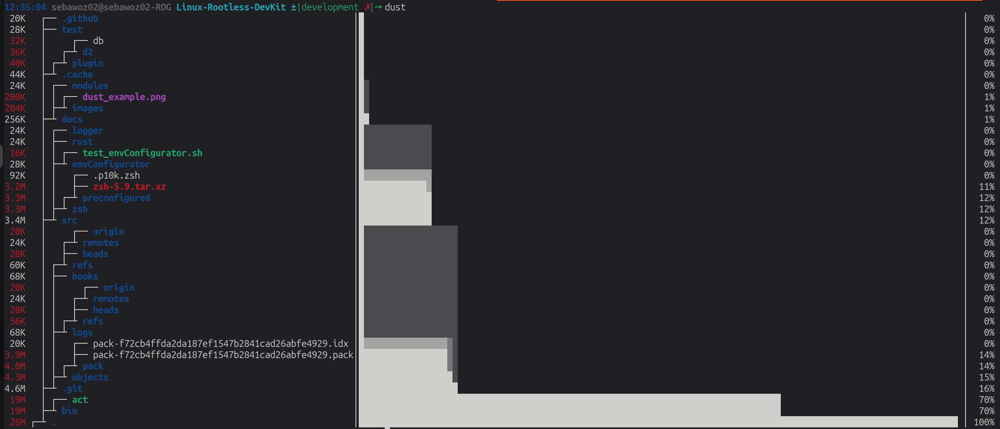
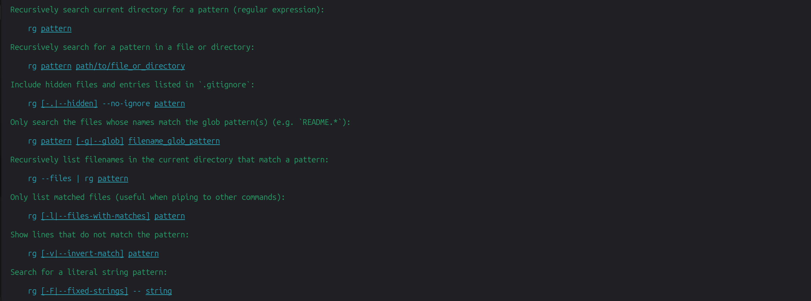
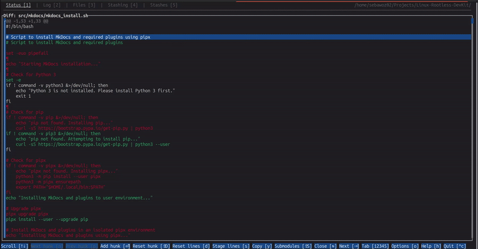
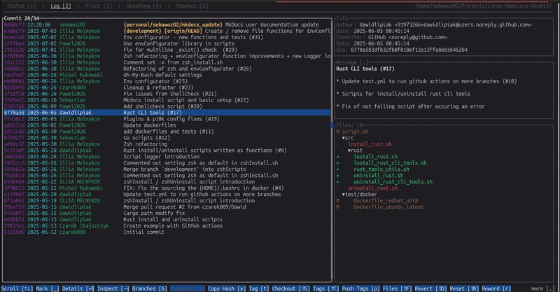
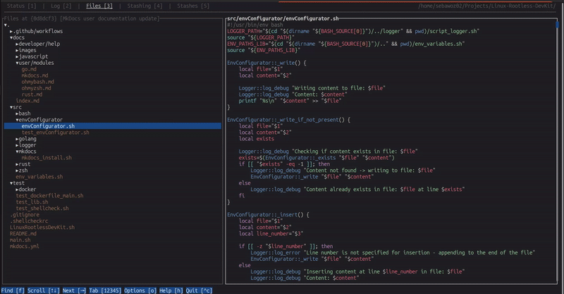
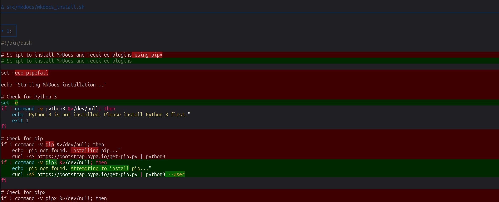
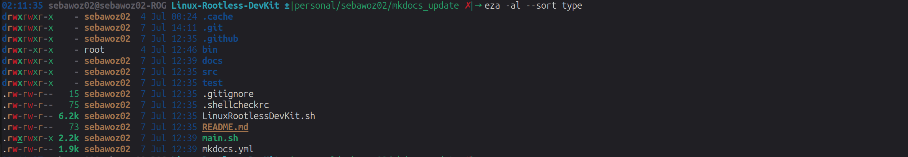
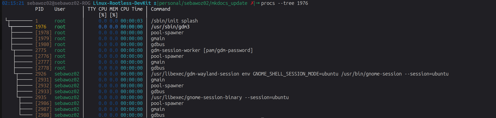

# Rust CLI Tools

This system includes a collection of fast, modern, and user-friendly command-line tools built with Rust. These tools are designed to enhance your terminal experience with better performance, visuals, and usability.

---

## Included Tools

### 📦 `dust`
A smarter version of `du` that shows disk usage with colorful, easy-to-read graphs.

---

### 📄 `tldr`
A quick-access tool for simplified and community-driven command examples (like `man`, but more helpful).

---

### 🔍 `rg` (ripgrep)
A blazing-fast search tool, much faster and more accurate than `grep`.

---

### 🧭 `gitui`
A fast and intuitive terminal UI for Git that lets you navigate and manage repositories visually.

#### Commit, Push, Manage Branches

#### Easier viewing and management of logs

#### File browser with fuzzy finder and git blame

---

### 🌈 `delta`
Improves `git diff` and `git show` by adding beautiful syntax highlighting and better formatting.

---

### 🕘 `atuin`
Supercharges your shell history with search, sync, and tracking. Find old commands instantly.

Official website: [https://atuin.sh](https://atuin.sh)

---

### 📁 `eza`
A modern replacement for `ls` with color, tree views, and Git status indicators.

---

### 📊 `tokei`
Counts lines of code in your project and breaks them down by language.

---

### 👥 `procs`
A more informative and colorful version of `ps` to show running processes.

<!--
### 🧠 `zoxide`  
A smarter `cd` command that learns and remembers your most used directories. *(Currently disabled)*
-->

---

These tools are chosen to improve everyday terminal usage — from searching and navigating files to managing Git repositories and tracking your shell history.

Enjoy a faster, more efficient CLI experience!

### Useful Links
- Official Website: [https://www.rust-lang.org/](https://www.rust-lang.org/)
- Documentation: [https://doc.rust-lang.org/](https://doc.rust-lang.org/)
- GitHub Repository: [https://github.com/rust-lang/rust](https://github.com/rust-lang/rust)
